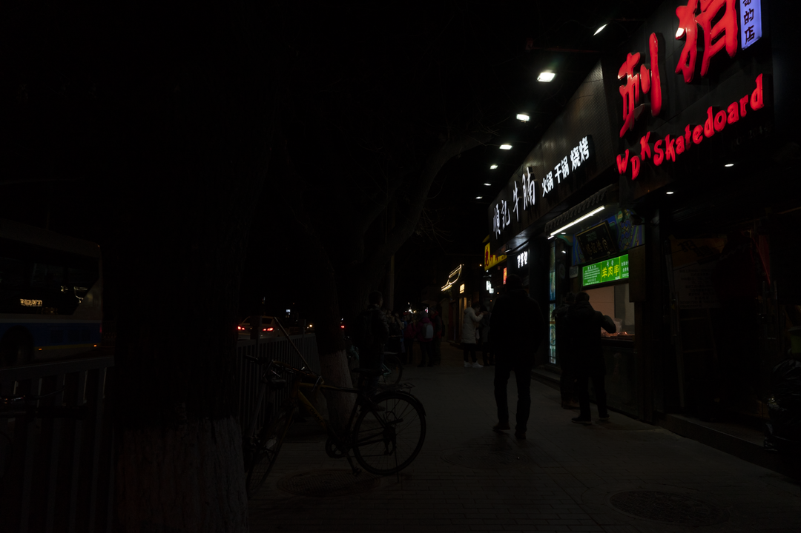
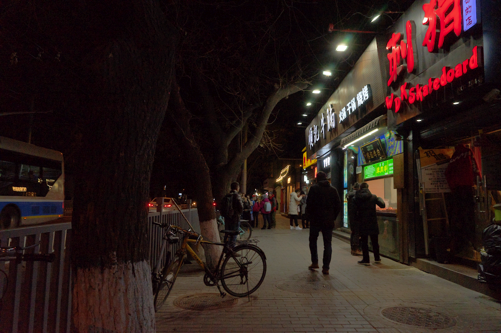
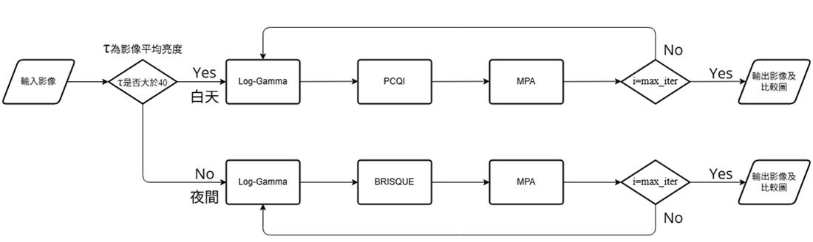
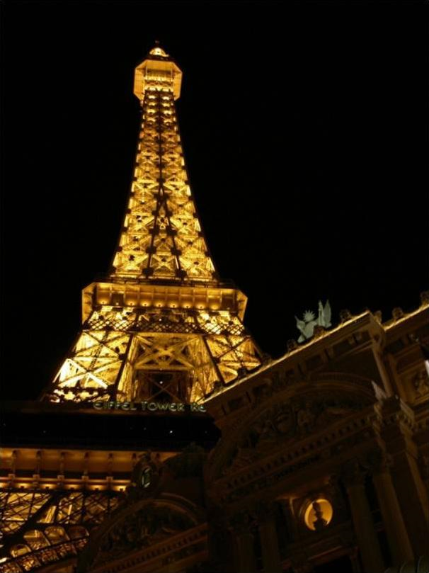
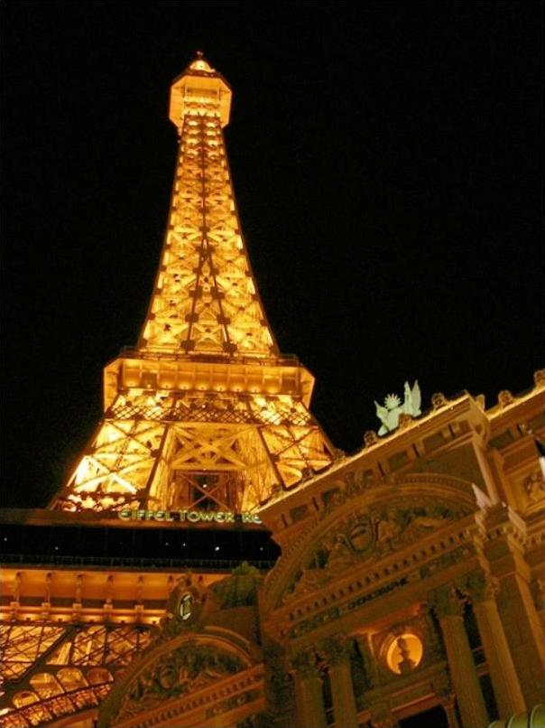
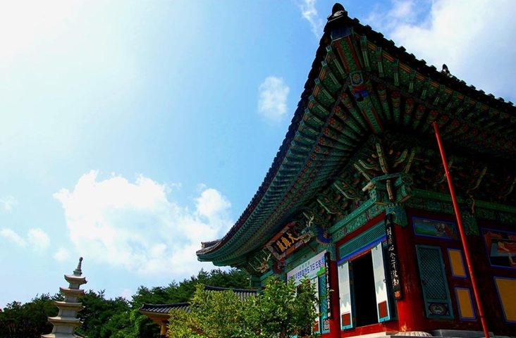
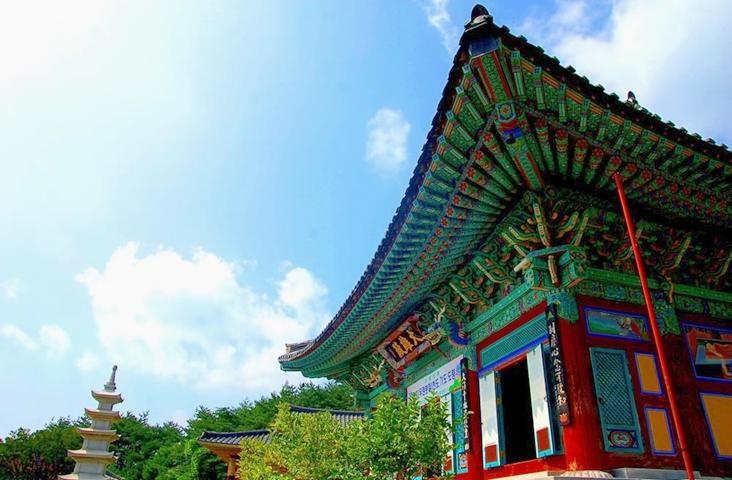
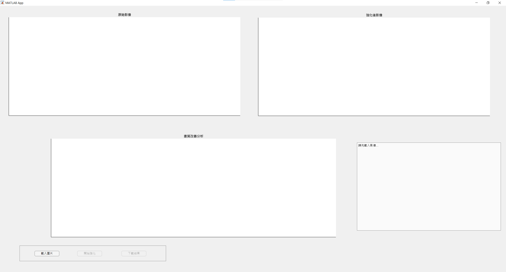
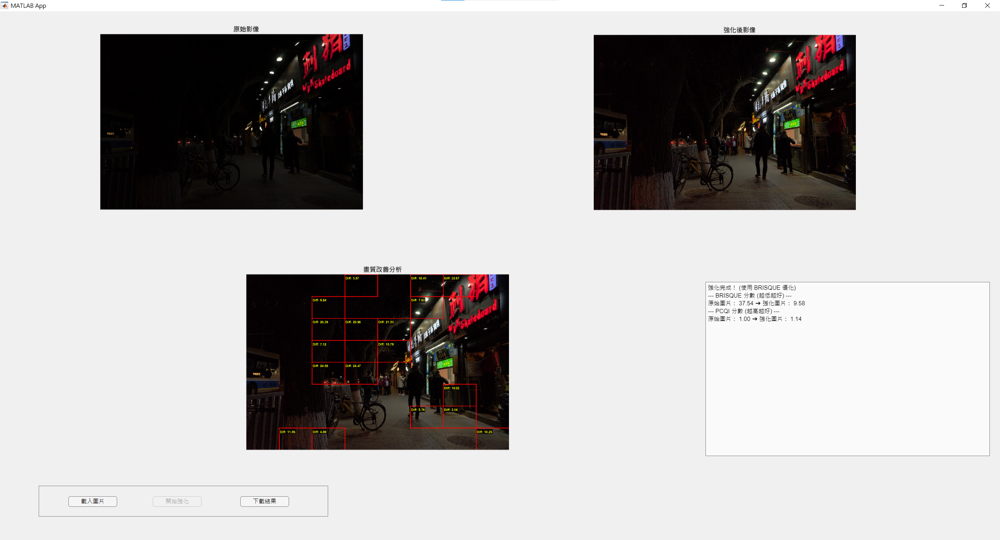

# 使用最佳化指數與對數轉換之影像強化方法

本專案首先計算輸入影像之平均亮度，並以亮度值 40 為決策臨界點進行自適應分流：當平均亮度大於 40 時以 PCQI 為優化指標，低於或等於 40 則切換為 BRISQUE。隨後，系統將影像轉換至 HSV 色彩空間並抽取明度 (V) 通道，透過 MPA 演算法自適應尋求 Log-Gamma 公式之最佳優化參數，最後整合雙重指標進行影像品質評估，並視覺化輸出局部畫質改善分析圖。

---

## 專案功能與核心技術

本專案主要針對 **HSV 色彩空間** 中的 **明度 (V) 通道** 進行優化處理：

*   **MPA海洋掠食者演算法：** 用於尋找最佳的明度優化參數。
*   **影像轉換公式：** 傳統的對數轉換（Log）與伽馬轉換（Gamma）在極暗影像中容易導致對比度失真或雜訊過大。因此，本專案採用結合兩者優勢的混合型對數-伽馬轉換公式 (Log-Gamma) 作為核心：

      $$y = \left( \frac{\log(1 + a \cdot x^b)}{\log(1 + a)} \right)$$

    (其中 $x$ 為輸入影像於 HSV 色彩空間中明度 (V) 通道之歸一化像素值，$y$ 為強化後之輸出明度值，$a$ 為對數控制參數，$b$ 為伽馬修正參數，皆由 MPA 演算法進行自適應尋優。)
*   **視覺化介面：** 提供直覺的圖形化操作介面。
*   **客觀品質評估**：
      * **PCQI（基於區塊之對比品質指標）**：屬於全參考指標，透過與原圖進行局部區塊比對，用以衡量影像的對比度強化效果與結構保真度。
      * **BRISQUE（無參考影像空間品質評估器）**：屬於無參考指標，不需對照原圖，直接依據自然場景統計模型，用以評估影像的失真程度與畫面自然度。

---

## 演算法評估與選型

在專案初期，為了驗證其在低光源影像上的優越性，使用 **MPA(海洋掠食者演算法)**、**GWO (灰狼優化演算法)**、**HHO (哈里斯鷹演算法)** ，並在 DarkFace 資料集上以 PCQI 和 BRISQUE 指標進行評估。

專案在 DarkFace 資料集的 300 張低光影像上執行 GWO、MPA 和 HHO 演算法，使用影像轉換公式進行強化，並計算處理後影像的 PCQI 和 BRISQUE 平均分數。結果如下：

| 演算法 | 平均 PCQI(越高越好) | 平均 BRISQUE(越低越好) |
| :--- | :---: | :---: |
| GWO | 1.142 | 26.7657 |
| MPA | 1.1417 | 7.9412 |
| HHO | 1.1403 | 8.378 |

### 影像展示
| 原始影像 | GWO強化 | MPA強化 | HHO強化 |
| :---: | :---: | :---: | :---: |
|  |   |  |  |

### 實驗結論

本專案依據公開資料集測試之量化數據，作為核心優化演算法之評選依據：

* **PCQI**：GWO（1.1420）與 MPA（1.1417）表現幾乎持平，皆能有效重建暗部影像之結構資訊。
* **BRISQUE**：MPA 取得壓倒性優勢 (7.9412)，相較於 GWO（26.7657）與 HHO（8.3780），其非自然失真率達到最低。

**決策結論**：綜合兩大客觀量化指標，MPA 演算法在維持同等優異對比度（PCQI）的前提下，展現了最強大的噪點壓制與畫質修復能力。因此，本專案最終選定 MPA 作為核心優化演算法。

---

## 資料集

本專案於演算法評估與多場景測試中，共採用了以下兩個公開資料集：

1. **DarkFace 資料集**
   * **說明**：包含大量適用於真實夜間與極暗場景之影像。
   * **連結**：https://www.kaggle.com/datasets/soumikrakshit/dark-face-dataset

2. **DICM 資料集**
   * **說明**：包含 69 張由數位相機拍攝的真實生活低光源影像。
   * **連結**：https://github.com/baidut/BIMEF

> ⚠️ **重要說明**：由於智慧財產權限制，本倉庫未包含上述影像資料集。請點擊上方連結自行下載。

---

## MPA演算法參數設定

*   **族群大小 (nPop)**：30
*   **最大迭代次數 (Max_iter)**：20
*   **參數 a 搜尋範圍 (lb ~ ub)**：1 ~ 100
*   **參數 b 搜尋範圍 (lb ~ ub)**：0.01 ~ 3

---


## 流程圖



1. **影像前置判斷**：系統讀入原始影像後，首先計算其平均亮度值 $\tau$。
2. **自適應分流**：依據 $\tau$ 值的臨界點進行條件判定：
   * **Yes (白天模式，$\tau > 40$)**：套用 Log-Gamma 公式，並以 **PCQI** 為優化指標。
   * **No (夜間模式，$\tau \le 40$)**：套用 Log-Gamma 公式，並以 **BRISQUE** 為優化指標。
3. **MPA 參數迭代最佳化**：進入海洋掠食者演算法的優化迴圈：
   * 在每次迭代中，利用 MPA 動態尋找最佳的 $a$ 與 $b$ 參數組合。
   * 檢查當前迭代次數是否達到最大值（$i = max\_iter$）。若尚未達到（No），則返回 Log-Gamma 繼續進行更新與計算。
4. **成果與分析輸出**：當滿足結束條件（Yes）跳出迴圈，系統隨即輸出最終的強化影像，並啟動後置分析模組顯示局部比較圖。

---

## 成果展示

| 原始影像 (Original) | 強化後影像 (Enhanced) | 原始影像 (Original) | 強化後影像(Enhanced) |
| :---: | :---: | :---: | :---: |
|  |  |  |  |
| **PCQI:** 1.0000 <br> **BRISQUE:** 23.5257 | **PCQI:** 1.1252 <br> **BRISQUE:** 10.4119 | **PCQI:** 1.0000 <br> **BRISQUE:** 22.0977 | **PCQI:** 1.0236 <br> **BRISQUE:** 16.0764  |
* **PCQI：** 分數愈高愈好，代表影像對比度與細節得到提升。
* **BRISQUE：** 分數愈低愈好，代表畫面越自然、無刺眼雜訊。

---

## 專案結構

```text
Image-Enhancement-Optimization/
├── images/
│   ├── street.png              # 場景 A 原始圖
│   ├── GWO_Enhanced.png        # 場景 A 經過 GWO 演算法強化後成果圖
│   ├── MPA_Enhanced.png        # 場景 A 經過 MPA 演算法強化後成果圖
│   ├── HHO_Enhanced.png        # 場景 A 經過 HHO 演算法強化後成果圖              
│   ├── tower.png               # 場景 B 原始圖
│   ├── tower_log-gamma.png     # 場景 B 成果圖
│   ├── temple.png              # 場景 C 原始圖
│   ├── temple_log-gamma.png    # 場景 C 成果圖
│   ├── ui_blank.png            # 空白操作介面圖
│   └── ui_enhanced.png         # 強化後操作介面圖
├── ImageEnhancerApp.mlapp      # MATLAB App 核心控制與圖形化介面
├── analyze_improvement.m       # 後置 8x8 網格影像改善分析與繪框工具
├── run_mpa_optimization.m      # MPA 演算法核心優化函式 (支援 GPU)
├── calculate_brightness.m      # 影像前置平均亮度計算功能
├── PCQI.m                      # 評分方式
├── MPA.m                      # 海洋掠食者演算法腳本
├── GWO.m                      # 灰狼演算法腳本
├── HHO.m                      # 哈里斯鷹演算法腳本
└── README.md                   # 專案說明文件

```

---

## 安裝指南

### 1. 環境需求
*  MATLAB(建議 R2024b 或更高版本)，需安裝以下工具箱：
   * **Image Processing Toolbox**：負責基礎影像讀寫、HSV 色彩空間轉換與 BRISQUE 品質評估指標。
   * **Parallel Computing Toolbox**：負責驅動底層海洋掠食者演算法 (MPA) 的 GPU 矩陣運算與硬體加速。

> **如何檢查工具箱？**
> 開啟 MATLAB ➔ 點擊上方工具列的 **主頁 (Home)** ➔ **附加功能 (Add-Ons)** ➔ **管理附加功能 (Manage Add-Ons)**，即可確認是否已成功安裝。

---

### 2. 專案檔案結構 (Repository Structure)
請確保 Clone 或下載本專案後，以下 5 個核心執行檔案完整存在於同一個工作資料夾下，主程式與 App 即可正常驅動（其餘 MPA.m、GWO.m、HHO.m 為初期實驗對比腳本，不影響 App 執行）：

* `ImageEnhancerApp.mlapp` —— 系統核心圖形化操作介面
* `calculate_brightness.m` —— 模組 1：平均亮度計算功能
* `run_mpa_optimization.m` —— 模組 2：MPA 演算法核心迭代與優化函式
* `analyze_improvement.m`  —— 模組 3：後置 8x8 網格影像改善分析工具
* `PCQI.m`                 —— 外部指標：官方客觀對比品質指標評分演算法

---

### 3. 專案執行三步驟 (Execution Steps)

#### 步驟一：路徑正確性確認
打開 MATLAB 軟體後，請先看左側的「檔案瀏覽器 (Current Folder)」，**將工作目錄徹底切換至包含上述 5 個檔案的資料夾路徑**。

#### 步驟二：開啟並執行 App
在 MATLAB 的檔案瀏覽器中，找到 **`ImageEnhancerApp.mlapp`**，對其按**滑鼠左鍵雙擊點開**，系統會自動載入 App Designer 介面。接著點擊上方工具列綠色的 **「執行 (Run)」** 按鈕。

#### 步驟三：系統功能操作
1. **載入影像**：點擊按鈕導入一張 RGB 彩色影像，系統會自動在左側渲染原始影像。
2. **開始強化**：點擊後系統會跳出進度條，並自動在後台完成自適應亮度分流、MPA 優化迭代與 8x8 網格畫質改善分析。最終會於右下角文字框**同時精準顯示 BRISQUE 與 PCQI 的評估分數**。
3. **下載結果**：點擊後可自由選擇本地路徑，導出高畫質的強化後影像。

---

## 介面操作展示

本專案開發了直覺式的圖形化操作介面，用戶無需接觸底層代碼即可完成自適應影像強化與畫質分析：

<table align="center">
  <tr>
    <td align="center"><b>未載入影像之原始介面</b></td>
    <td align="center"><b>影像強化與 8x8 網格分析成果</b></td>
  </tr>
  <tr>
    <td></td>
    <td></td>
  </tr>
</table>

---

## 參考文獻

[1] **MPA 演算法**
   * **學術論文**：Faramarzi, A., Heidarinejad, M., Mirjalili, S., & Gandomi, A. H. (2020). Marine Predators Algorithm: A nature-inspired metaheuristic optimization algorithm. *Expert Systems with Applications*, 152, 113377. [[ScienceDirect 論文連結](https://doi.org/10.1016/j.eswa.2020.113377)]
   * **開源倉庫**：https://github.com/afshinfaramarzi/Marine-Predators-Algorithm

[2] **GWO 演算法**
   * **學術論文**：Mirjalili, S., Mirjalili, S. M., & Lewis, A. (2014). Grey Wolf Optimizer. *Advances in Engineering Software*, 69, 46-61. [[ScienceDirect 論文連結](https://doi.org/10.1016/j.advengsoft.2013.12.007)]
   * **開源倉庫**：https://github.com/alimirjalili/GWO

[3] **HHO 演算法**
   * **學術論文**：Heidari, A. A., Mirjalili, S., Faris, H., Aljarah, I., Mafarja, M., & Chen, H. (2019). Harris hawks optimization: Algorithm and applications. *Future Generation Computer Systems*, 97, 849-872. [[ScienceDirect 論文連結](https://doi.org/10.1016/j.future.2019.02.028)]
   * **開源倉庫**：https://github.com/aliasgharheidaricom/Harris-Hawks-Optimization-Algorithm-and-Applications

[4] Gu, K., Lin, W., Jiang, G., & Tao, D. (2015). A patch-based contrast quality index for digital images. *IEEE Transactions on Multimedia*, 18(3), 386-397. [[IEEE Xplore 論文連結](https://ieeexplore.ieee.org/document/7289355)]

[5] Mittal, A., Moorthy, A. K., & Bovik, A. C. (2012). No-reference image quality assessment in the spatial domain. *IEEE Transactions on Image Processing*, 21(12), 4695-4708. [[IEEE Xplore 論文連結](https://ieeexplore.ieee.org/document/6272356)]